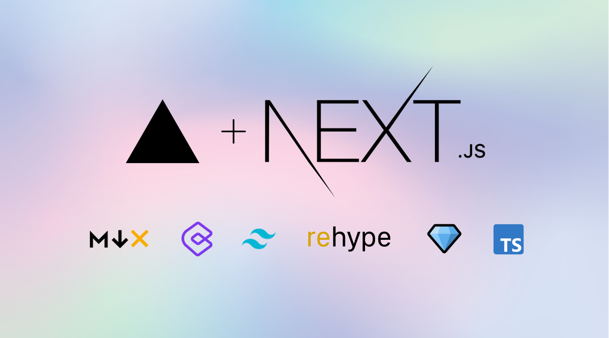

## Installation 

Install the dependencies by running the following command.

```bash
npm install
# or
yarn install
```

Finally, run the following command to start the development server.

```bash
npm run dev
# or
yarn dev
```

Open [http://localhost:3000](http://localhost:3000) with your browser to see the result.
